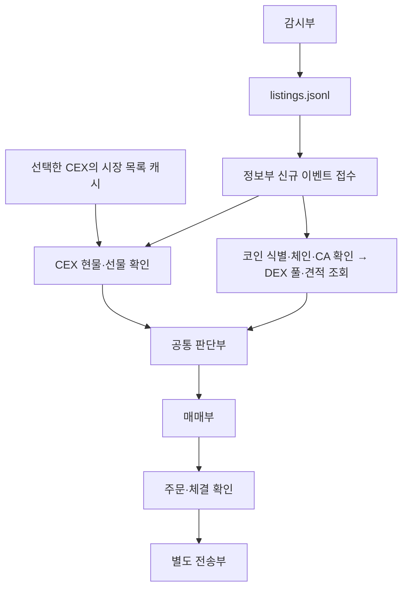

# NewListingBot

> 진행상황 기준: 2026-10-05

## 핵심만

- **목표:** 신규상장 감지 → 기존 CEX·DEX 시장 확인 → 현물/선물 매매 → 코인 전송.
- **완료:** 감시부의 파일 기록 + 정보부의 신규 기록 감지·조회 대기 접수.
- **미구현:** 실제 거래소 조회, 코인 식별 검증, 판단부, 매매, 전송.
- **다음:** 실제 피드 샘플 확인 → 사용할 CEX 선정·목록 캐시 → 코인 식별·DEX 조회.
- **검증:** 오프라인 테스트 11개 통과. 실제 피드 연결·지연 측정은 아직 안 했음.

## 1. 목표와 역할

NewListings에서 소식을 받으면 상장 거래소와 입금 네트워크를 확인하고, 같은 코인이 이미 거래되는 시장을 찾는다. CEX·DEX 및 현물·선물을 구분하고, 최종적으로 매수·포지션 진입·전송까지 연결한다.

한 프로젝트 안에서 역할을 나누며, 현재 감시부와 정보부는 별도 프로세스로 실행한다. 추후 주문·전송도 별도 실행 프로세스로 분리한다.

| 역할 | 담당 | 현재 상태 |
| --- | --- | --- |
| 감시부 | 피드 수신, 상장 이벤트 선별, 파일 추가 기록 | 구현됨. 실피드 검증 필요 |
| 정보부 | 신규 기록 접수, 선택한 CEX의 시장 목록·검증된 코인 매핑 보관 | 접수만 구현. 캐시는 미구현 |
| 조회부 | 처음 보는 코인 식별, 네트워크·CA·CEX 상품·DEX 풀 조회 | 미구현. 초기에는 정보부 내부 모듈로 구성 가능 |
| 판단부 | 전략 조건, 정보 유효성, 금액 한도, 중복 주문·자금 예약 통제 | 미구현 |
| 매매부 | CEX 현물·선물 및 DEX 스왑 실행, 주문·체결 추적 | 미구현 |
| 전송부 | 출금·온체인 전송·도착 확인 | 미구현 |

## 2. 설계

### 지금 구현된 흐름

```text
NewListings → client.cjs → data/listings.jsonl
                                  ↓ 새로 추가된 줄 감지
                               info.cjs
                                  ↓ 조회 대기 접수
                         data/info-results.jsonl
```

`info-results.jsonl`은 지금 **조사 완료 결과가 아니라 조회 대기 작업 기록**이다.

| 현재 상태값 | 의미 |
| --- | --- |
| `LOOKUP_PENDING` | 파일 전달·접수 완료. 실제 조회는 대기 |
| `UNVERIFIED` | 동일 코인인지 아직 검증하지 않음 |
| `NOT_QUERIED` | CEX·DEX·입금 네트워크를 아직 조회하지 않음. 시장 부재가 아님 |
| `trading_allowed: false` | 현재 항상 false. 주문 기능도 없음 |

### 목표 흐름 — 조회 이후는 미구현



- **조회는 병렬:** 각 경로에 필요한 정보가 확인되면 판단부로 전달한다. CEX 경로는 DEX의 CA 조회를 기다리지 않는다.
- **주문 허가는 한 군데:** CEX·DEX 워커가 각각 임의로 매수하지 않는다. 공통 판단부가 자금·중복 주문을 통제한다.
- **거래 가능 여부는 별도 확인:** 상장 소식이나 상품 목록에 있다는 사실만으로 즉시 주문하지 않는다. 거래 상태·주문 조건·호가/견적도 확인한다.
- **모호하면 보류:** 티커만 같다고 동일 코인으로 확정하지 않는다. 필수 정보가 불명확하거나 오래되었으면 해당 전략의 주문을 보류한다.
- **불명확한 주문 재시도 금지:** 타임아웃 후에는 주문 ID/tx hash로 상태부터 확인한다. 재시작해도 남는 주문 의도·실행 기록을 둔다.
- **AI/Surf는 보조:** 불명확한 프로젝트 정보 조사에 활용한다. 주문 허가와 수량 계산은 정해둔 코드 규칙으로 처리한다.

### 미리 저장할 정보의 범위

어떤 코인이 신규상장할지 미리 아는 구조가 아니다. 미리 받을 것은 **선택한 CEX의 현재 현물·선물 상품 목록**과 **이미 동일 코인임을 검증한 매핑**이다.

처음 보는 코인은 이벤트가 온 뒤 조사한다. DEX 풀도 해당 코인의 체인·CA로 조회한다. 전 세계 토큰·풀·거래 이력을 모두 저장하지 않는다. 캐시의 크기·갱신 주기·만료 정책은 구현 단계에서 정한다.

| 대상 | 식별 기준 |
| --- | --- |
| 내부 자산 | 확인된 프로젝트 식별자와 근거 |
| CEX | 검증된 자산 매핑 + 거래소별 상품 ID + 현물/선물 구분 |
| DEX 현물 | 체인 + CA, DEX별 풀 주소 또는 풀 ID |
| DEX 선물 | 해당 프로토콜의 상품 API. 현물 풀 검색과 별도 |
| 전송 경로 | 출발 거래소 출금 네트워크 + 목적지 입금 네트워크 + 주소·메모 |

`1000` 같은 선물 심볼 접두사를 단순히 지우지 않는다. 상품 ID·배율·계약 크기·주문 단위를 확인해서 매핑한다.

### 데이터 조회 방향

아래는 채택할 방향이며, 실제 조회 어댑터는 아직 구현하지 않았다.

| 확인할 것 | 우선 경로 |
| --- | --- |
| 상장 소식 | NewListings 피드 |
| 프로젝트·입금 네트워크·거래 시작 조건 | 해당 거래소 공식 공지·공식 API |
| CEX 현물·선물 상품 | 선택한 거래소의 원천 API. CCXT는 보조 후보 |
| 코인 메타데이터·체인별 CA 후보 | 공식 프로젝트 정보 우선, CoinGecko 등으로 보충 |
| DEX 현물 풀 후보 | DexScreener / GeckoTerminal |
| 실제 매수 경로 | DEX·프로토콜별 풀 검증과 실제 금액의 견적 |
| 모호한 정보 | Surf Data API / AI 보조 조사 |

풀 유동성 1등만 보고 매수 경로를 확정하지 않는다. 수수료·가격 충격·실제 거래 가능 여부까지 확인한다. 호출 몇 번으로 모든 시장을 찾는다고 가정하지 않으며, 페이지 조회·체인 ID 변환·호출 제한을 처리한다.

## 3. 구현 진행상황

| 기능 | 상태 |
| --- | --- |
| WebSocket 인증·수신·화면 출력 | 구현 |
| 재접속 대기 증가·일부 오류에서 중단 | 구현 |
| 신규상장 선별·표준 형식 변환·원본 포함 저장 | 구현 |
| 신규 줄 감지·완성된 줄만 처리·바이트 커서 저장 | 구현 |
| 재시작 이어읽기·접수 결과 중복 방지·프로세스 잠금 | 구현 |
| 끊긴 파일 꼬리 보존·복구 | 구현 |
| 실제 피드로 처음부터 끝까지 확인 | 미검증 |
| CEX 목록 캐시·코인 매핑·CA/네트워크·DEX 조회 | 미구현 |
| 조회 작업의 실행·실패·재시도 상태 관리 | 미구현 |
| 판단·모의 매매·실주문·전송 | 미구현 |

마지막 검증에서 **오프라인 테스트 11개가 통과**했다. 가짜 소켓 전달, 이벤트 선별, 중복 접수, UTF-8 부분 기록, 재시작과 커서 갱신 전 종료, 파일 알림 누락, 잘못된 JSON, 파일 축소·교체, 꼬리 복구, 부분 결과, 중복 실행·결과 유실을 확인했다.

실제 API 키를 이용한 피드 연결·CEX/DEX 조회·주문·전송은 실행하지 않았다. 코드 변경은 설계한 파일 전달 범위에 한정했다.

## 4. 현재 파일 구조

```text
newlistingbot/
├─ client.cjs                 # 감시부 실행
├─ info.cjs                   # 정보부 접수 실행
├─ lib/
│  ├─ listing-event.cjs       # 상장 이벤트 정리·내부 ID·조회 대기 작업 생성
│  ├─ info-consumer.cjs       # 새 줄 읽기·중복 방지·커서 관리
│  ├─ jsonl.cjs               # 추가 기록·flush·꼬리 복구·상태 파일 교체
│  ├─ lock.cjs                # 중복 실행 방지
│  └─ paths.cjs               # 프로젝트 기준 경로
├─ test/handoff.test.cjs      # 오프라인 검증
├─ data/listings.jsonl        # 수신한 상장 기록
├─ data/info-results.jsonl    # 조회 대기 접수 기록
├─ state/info-consumer.json   # 마지막 접수 위치
├─ state/*.lock              # 실행 중 잠금
├─ package.json
└─ .env                      # NLF_KEY. Git 제외
```

`data/`, `state/`, `node_modules/`도 Git에서 제외한다. 데이터 파일은 실행 시 생성하며, 명령을 실행한 위치와 관계없이 프로젝트 내부 경로를 사용한다.

## 5. 실행과 확인

Node.js 22 이상이 필요하다. `.env`에 `NLF_KEY=발급받은키`를 설정한다. `ws`가 설치되어 있지 않으면 `npm install`로 설치한다.

프로젝트 폴더에서 **터미널 두 개로 각각 실행**한다.

```powershell
# 터미널 1: 감시부. 실제 NewListings에 연결함
node --env-file=.env client.cjs
```

```powershell
# 터미널 2: 정보부. 현재 외부 API 호출 없음
node info.cjs
```

정보부를 먼저 실행해도 감시부 파일 생성을 기다린다. `Ctrl+C`로 종료한다.
기존 `node client.cjs` 방식은 `NLF_KEY`를 실행 환경에 미리 설정했을 때 사용할 수 있다.

```powershell
# 외부 연결 없이 현재 미접수 기록만 처리하고 종료
node info.cjs --once

# 임시 폴더의 가짜 이벤트로 테스트
node --test
```

동일한 npm 명령: `npm run start:watcher`, `npm run start:info`, `npm run info:once`, `npm test`.

## 6. 파일 전달 규칙과 현재 한계

- `announcement`/`tweet` 중 `parser.classification.event === "listing"`인 메시지만 저장한다. 전체 피드 원본 로그는 아니다.
- 기록마다 `raw`를 보존한다. 여러 코인은 `assets` 배열로 유지하고, 티커·CA가 없어도 상장 이벤트는 남긴다.
- `roadmap`, `soon-spot`, `alpha` 등 원래 분류를 유지한다. 해당 이벤트를 거래 가능으로 판단하지 않는다.
- Feed ID는 지역/엔드포인트 공통 ID가 아니므로 소스 URL·내용·분류·티커로 내부 `event_id`를 만든다. 재수신은 입력에 남을 수 있지만 동일 ID의 접수 결과는 한 건만 만든다.
- 파일 변경 알림으로 확인하고 **1초마다 보완 확인**한다. 완성된 줄만 읽으며 처리 위치는 바이트 기준이다.
- 접수 결과를 먼저 쓰고 flush한 뒤 커서를 갱신한다. 중간 종료 후에는 결과의 ID로 접수 중복을 막는다. **이 커서는 API 조회 완료 위치가 아니다.**
- 기록 실패·잘못된 완성 JSON·입력 파일 교체/축소는 오류를 표시하고 중단한다. 자동으로 건너뛰지 않는다.
- 불완전 꼬리는 작성자 재시작 시 `.partial-*`에 보존하고 제거한다. 완성 JSON의 줄바꿈만 없으면 줄바꿈을 복구한다. 복구 내용을 출력한다.
- 감시부·정보부는 각각 한 개만 실행한다. 죽은 PID의 잠금은 다음 실행 시 해제한다. 손상된 잠금 또는 남은 `.recovery` 파일은 프로세스 종료 여부 확인 후 수동 정리해야 한다.

**운영 시 보존할 것:** 입력 파일을 비우거나 덮어쓰지 않는다. `data/`와 `state/`는 함께 보존한다. 결과 파일만 지우면 커서와 불일치하므로 중단한다.

**아직 남은 한계:** 파일 순환/보관과 중복 인덱스 크기 제한은 미구현이다. 기록·인덱스는 계속 커진다. 연결 단절 중 외부 소식은 자동 복구하지 않는다. 파일 전달 지연도 실측하지 않았다. OneDrive 경로에서도 같은 컴퓨터의 로컬 파일로 전달하며 다른 컴퓨터 동기화를 전달 수단으로 사용하지 않는다.

## 7. 앞으로 할 일

| 순서 | 작업 | 완료 기준 |
| --- | --- | --- |
| 1 | 실제 피드 검증 | 실상장 샘플 확보, 필드·분류 확인, 수신→기록→접수 지연 측정 |
| 2 | CEX 정보부 | 사용할 거래소 선정, 현물·선물 목록 API와 캐시·갱신/만료 구현 |
| 3 | 코인 식별·조회부 | 공식 공지 기반 동일 코인·입금 네트워크·체인/CA 확인. 애매하면 보류 |
| 4 | DEX 및 병렬 조회 | 풀 탐색·프로토콜 검증·견적, CEX/DEX 결과에 출처·확인 시각·유효성 기록 |
| 5 | 조회 작업 상태 관리 | 접수와 조회 완료를 분리. 대기/실행/완료/실패·재시도를 재시작 후 이어감 |
| 6 | 판단부와 모의 실행 | 전략·한도·자금 예약·중복 주문 통제, 주문 없이 판단 결과 검증 |
| 7 | 매매부 | CEX 현물부터 연결. 이후 선물·DEX 스왑을 별도 어댑터로 추가하고 주문/체결 추적 |
| 8 | 전송부 | 체결 확인 후 네트워크·주소·메모·출금 상태·온체인 확인·도착 추적 |
| 9 | 운영 보완 | 기록 보관/순환, 단절 복구, 모니터링, 장애 재시작, 실측한 병목 개선 |

아직 정할 것: 첫 지원 CEX·체인·DEX, 캐시 갱신 주기와 크기, 매수·선물 전략과 한도, API/피드 유료 플랜 사용 여부, 파일 방식의 성능 목표와 교체 조건.

설계 합의 → 해당 단계 구현 → 검증 순서로 진행한다. 실거래·전송은 전략과 한도가 정해지고 모의 실행 검증이 끝난 뒤 연결한다.

## 참고 문서

- [NewListings Full 스키마](https://newlistings.pro/docs/v2/full)
- [NewListings 키·플랜](https://newlistings.pro/docs/keys)
- [Node.js 파일 감지 제약](https://nodejs.org/api/fs.html#caveats)
- [CoinGecko 코인 메타데이터](https://docs.coingecko.com/reference/coins-id)
- [DexScreener API](https://docs.dexscreener.com/api/reference)
- [GeckoTerminal API](https://apiguide.geckoterminal.com/)
- [CCXT 상품 ID·심볼](https://github.com/ccxt/ccxt/wiki/Manual#symbols-and-market-ids)
- [Surf Data API](https://platform.asksurf.ai/docs/data-api/overview)
